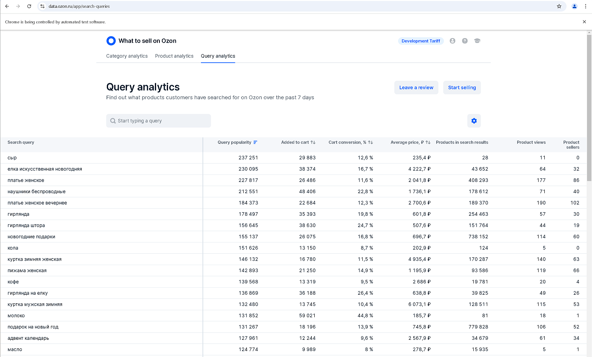

# Ozon Search Queries Collector

Ozon Search Queries Collector is a `proof of concept` project designed to collect search query
data from [What to Sell on Ozon](https://data.ozon.ru/app/search-queries). It provides insights into trending products
and related search behavior on the Ozon marketplace.



## **Features**

This project collects detailed search query data from Ozon:

### Meta data:

- **`_keyword`**: The initial keyword used to generate the data.
- **`_scraped_at`**: Timestamp of when the data was scraped.

### Scraped data:

- **`avgCaRub`**: Average price (in rubles) per query, representing the typical price range for products
  associated with the search query.
- **`avgCountItems`**: The average number of products appearing in search results for the query.
- **`ca`**: The cart conversion rate, showing how frequently users add products related to the query to their shopping
  cart.
- **`count`**: The popularity of the search query, measured by the total number of times it was searched.
- **`itemsViews`**: The average number of product views for items appearing in search results for the query.
- **`query`**: The actual search query string entered by users.
- **`uniqQueriesWCa`**: The number of unique queries where users added products to their cart.
- **`uniqSellers`**: The number of unique sellers offering products related to the query.

## **Setup**

### **Prerequisites**

- Python 3.10+.
- Poetry.
- Google Chrome.

### **Installation**

1. Clone the repository:
   ```bash
   git clone git@github.com:sergerdn/ozon-search-queries-collector.git
   cd ozon-search-queries-collector
   ```
2. Install dependencies using Poetry:
   ```bash
   poetry install
   ```

3. Configure your environment variables in `.env.development`:
    - `BROWSER_PROFILE_STORAGE_DIR`: Directory for persistent browser profiles.

## **Usage**

Run the spider using Scrapy with an initial keyword.

For example:

```bash
scrapy crawl ozon_data_query_spider -a initial_keyword="дозатор для жидкого мыла" -o items.json
```

### **First-Time Setup**

When running the script for the first time, you need to **log in manually** to the Ozon analytics service to grant the
spider access to the necessary data.

Follow these steps:

1. **Run the script for the first time**:
   ```bash
   scrapy crawl ozon_data_query_spider -a initial_keyword="дозатор для жидкого мыла"
   ```
2. **Manual Login**: The browser will open automatically, prompting you to log in to Ozon. Enter your credentials and
   complete the login process.
3. **Save the Session**: After logging in, **close the browser**. This action saves the session data to the persistent
   browser profile, enabling future automated logins.
4. **Re-run the script**:
   ```bash
   scrapy crawl ozon_data_query_spider -a initial_keyword="дозатор для жидкого мыла"
   ```

From the second run onward, the script will reuse the saved session to access the Ozon service.

## **Output**

The output will be in JSON format, containing structured data for the keyword and its related search queries.

Example:

```json
[
  {
    "_keyword": "дозатор для жидкого мыла",
    "_scraped_at": "2024-12-16T09:39:08.157158",
    "avgCaRub": 1050.92,
    "avgCountItems": 6592.7656,
    "ca": 0.2962,
    "count": 2907,
    "itemsViews": 60.26694,
    "query": "сенсорный дозатор для жидкого мыла",
    "uniqQueriesWCa": 861,
    "uniqSellers": 35.900585
  },
  {
    "_keyword": "дозатор для жидкого мыла",
    "_scraped_at": "2024-12-16T09:39:08.158146",
    "avgCaRub": 436.66,
    "avgCountItems": 21091.857,
    "ca": 0.3251,
    "count": 1261,
    "itemsViews": 43.363205,
    "query": "жидкое мыло для дозатора",
    "uniqQueriesWCa": 410,
    "uniqSellers": 18.18874
  }
]
```

## **Project Components**

### **Spiders**

- **`ozon_data_query_spider`**:
    - The main spider used to scrape Ozon search query data.
    - Supports Playwright for handling dynamic pages.

### **Templates**

- Jinja2 templates are used to inject dynamic JavaScript for data extraction.

### **Items**

- **`OzonCollectorItem`**:
    - Defines the structure for the scraped data.

## **Logs and Execution Time**

The spider includes enhanced logging and execution time tracking for debugging and performance monitoring.

